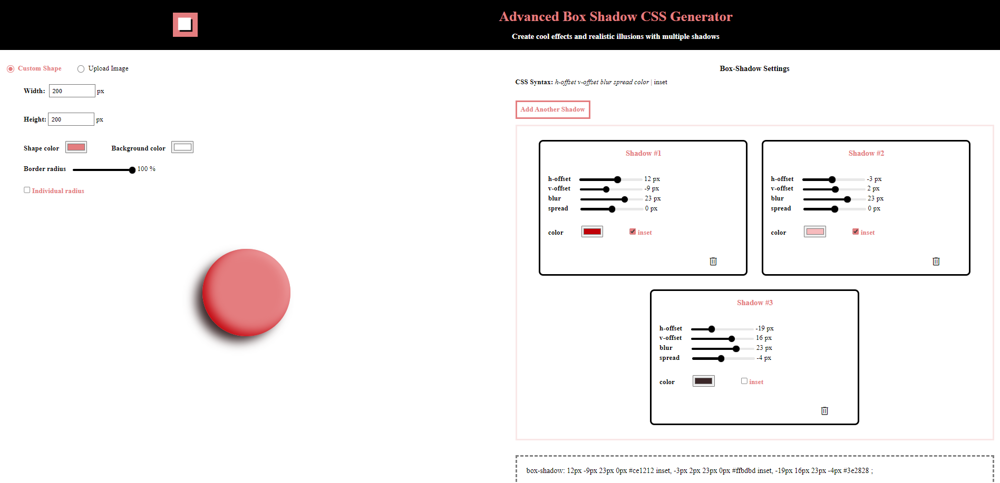

# Advanced Box Shadow CSS Generator 
The box-shadow property attaches one or more shadows to an element. This helps create a variety of interesting effects and illusions to any user interface. However, this property can be quite difficult to adjust, requiring minute changes to values just to achieve the desired effect.   
This is why I decided to develop the Advanced Box Shadow CSS Generator. This front-end tool can help you adjust the values easily, and when you're satisifed with the result, just copy the generated line of code into your own code.  
## Tools and Languages Used
+ Visual Studio Code
+ HTML/CSS
+ JavaScript
+ Vercel
## Images

*The main page for the Advanced Box Shadow CSS Generator web application*    

*The achieved effect after using the box shadow generator*
